# AI Agent Flow: Smart Content Automation System

## Overview
A sophisticated multi-agent system that automates personal brand content creation using cutting-edge AI technologies.

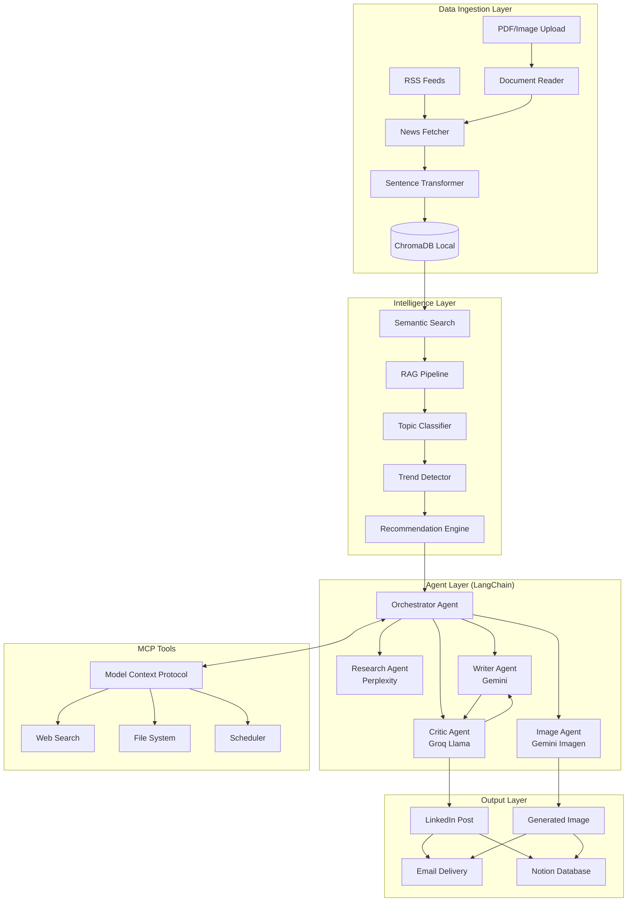

---

## User Review Required

> [!IMPORTANT]
> **API Keys Required**:
> - Gemini API Key (Google GenAI) - for writing and image generation
> - Perplexity API Key - for deep research
> - **Groq API Key** - for Critic Agent (free tier)
> - **LangSmith API Key** - for tracing and observability
> [!NOTE]
> **Simplified Architecture**: Using **ChromaDB (Local)** for all vector storage. No cloud DB sync required for this version.

---

## Architecture Components

### 1. Data Ingestion & Embedding Pipeline

| Component | Technology | Purpose |
|-----------|------------|---------|
| RSS Fetcher | `feedparser` | Collect articles from 12+ sources |
| Text Processor | Custom | Clean HTML, extract text |
| **Chunking** | `langchain` | Split into semantic chunks |
| Embeddings | `sentence-transformers` | Convert chunks to vectors |
| **Hot Storage** | `ChromaDB` (local) | Fast RAG for recent articles (0-7 days) |
| **Storage** | `ChromaDB` (local) | Fast RAG for recent articles (0-7 days) |

### Hybrid Vector Database Architecture

    subgraph "Single Vector Store (ChromaDB)"
        New[New Articles] --> Chroma[(ChromaDB<br/>Local Persistence)]
        Chroma --> RAG[Daily RAG Queries]
        Chroma --> Trends[Trend Analysis]
    end

| Layer | Technology | Data Age | Purpose | Storage Limit |
|-------|------------|----------|---------|---------------|
| **Hot** | ChromaDB | 0-90 days | Fast RAG & Trends | Local disk |

**Why This Split Works:**
- **ChromaDB** handles ~50-100 recent articles (fast, no latency)
- **MongoDB** stores ~500-1000 older articles (within 512MB free tier)
- Daily RAG only queries ChromaDB (fastest path)
- Historical/trend queries use MongoDB (when needed)

### 1a. News Ingestion (RSS + Web)

**Purpose**: Fetch latest AI news from RSS feeds and scrape article content for full context.

```python
# pipelines/ingestion.py
import feedparser
import requests
from bs4 import BeautifulSoup
from datetime import datetime
import time

class NewsFetcher:
    def __init__(self):
        self.headers = {'User-Agent': 'Mozilla/5.0 (Windows NT 10.0; Win64; x64) AppleWebKit/537.36'}
        # See RSS Sources section for feed URLs
        self.feeds = [...] 
    
    def fetch_feeds(self) -> list:
        """Fetch and parse all RSS feeds."""
        articles = []
        for feed_url in self.feeds:
            try:
                feed = feedparser.parse(feed_url)
                for entry in feed.entries[:5]: # Top 5 per feed
                    articles.append({
                        "title": entry.title,
                        "link": entry.link,
                        "published": entry.get("published", datetime.now().isoformat()),
                        "summary": entry.get("summary", ""),
                        "source": feed.feed.get("title", "Unknown")
                    })
            except Exception as e:
                print(f"Error fetching {feed_url}: {e}")
        return articles

class WebScraper:
    def __init__(self):
        self.headers = {'User-Agent': 'Mozilla/5.0'}
    
    def scrape(self, url: str) -> dict:
        """Extract main content from a webpage."""
        try:
            response = requests.get(url, headers=self.headers, timeout=10)
            soup = BeautifulSoup(response.text, 'html.parser')
            
            # Simple heuristic for main content
            # 1. Look for <article> tag
            article = soup.find('article')
            if article:
                text = article.get_text(separator="\n")
            else:
                # 2. Fallback to extracting all paragraphs
                text = "\n".join([p.get_text() for p in soup.find_all('p')])
                
            title = soup.find('h1').get_text() if soup.find('h1') else "Untitled"
            
            return {
                "title": title,
                "content": text.strip(),
                "source": "Web Scraper",
                "url": url,
                "date": datetime.now().isoformat()
            }
        except Exception as e:
            print(f"Scrape error {url}: {e}")
            return {"title": "Error", "content": "", "source": "Error", "url": url}
```

### 1b. PDF/Document Reader (PyPDF2)

**Purpose**: Process research papers, whitepapers, and text-based PDFs.

**Use Cases**:
- arXiv AI research papers
- Company whitepapers (OpenAI, Google, Anthropic)
- Standard text PDFs

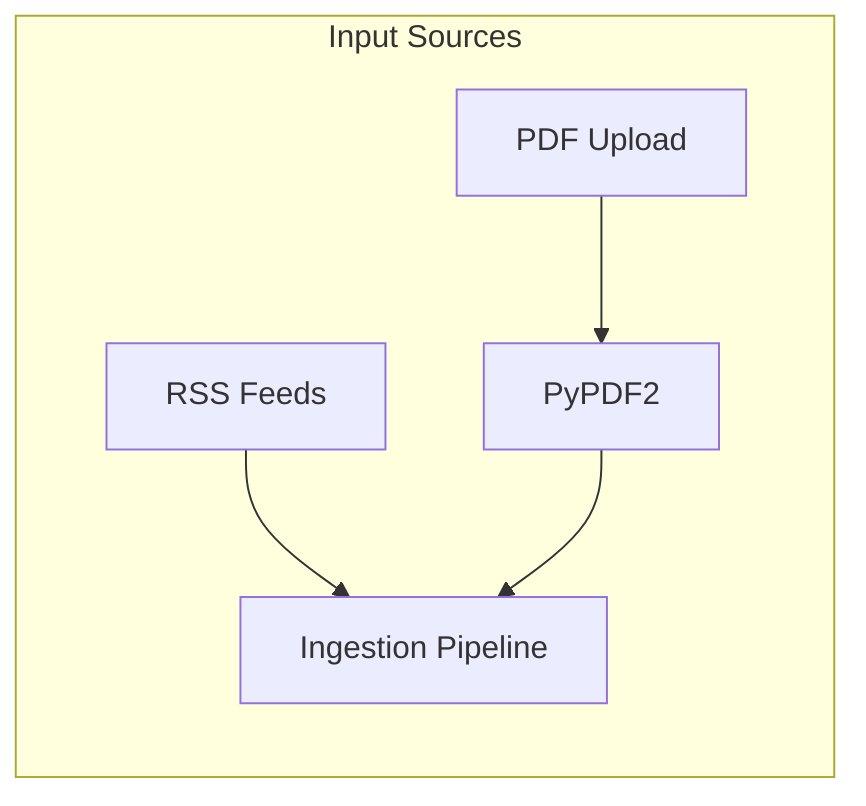

#### Implementation

```python
# pipelines/document_reader.py
import PyPDF2
import io
import os

class DocumentReader:
    def __init__(self):
        pass
    
    def read_pdf_local(self, pdf_path: str) -> str:
        """Extract text from text-based PDF (no OCR needed)."""
        with open(pdf_path, 'rb') as file:
            reader = PyPDF2.PdfReader(file)
            text = ""
            for page in reader.pages:
                text += page.extract_text() + "\n"
        return text
```

#### When to Use Each Method

| Method | When to Use | Cost |
|--------|-------------|------|
| `read_pdf_local()` | Text-based PDFs (most articles) | Free |
| `read_pdf_with_ocr()` | Scanned PDFs, images in PDF | ~$1.50/1000 pages |
| `read_image()` | Screenshots, image articles | ~$1.50/1000 images |

#### Integration with Pipeline

```python
# In main.py or ingestion.py
from pipelines.document_reader import DocumentReader

doc_reader = DocumentReader()

# Process uploaded PDF
if user_uploaded_pdf:
    text = doc_reader.read_pdf_local(pdf_path)
    if not text.strip():  # Scanned PDF, needs OCR
        text = doc_reader.read_pdf_with_ocr(pdf_path)
    
    article = {
        "title": extract_title(text),
        "content": text,
        "source": "PDF Upload",
        "date": datetime.now().isoformat()
    }
    # Add to ingestion pipeline
    chunks = chunker.chunk_article(article)
    # ... rest of pipeline
```

### 1c. Medium Paywall Bypass (Optional)

> [!WARNING]
> This feature bypasses Medium's paywall via Freedium mirror. **Use for personal research only**. Disabled by default.

```python
# pipelines/medium_reader.py
import requests
from bs4 import BeautifulSoup
import os

class MediumReader:
    def __init__(self):
        self.enabled = os.getenv("ENABLE_MEDIUM_BYPASS", "false").lower() == "true"
        self.mirror = "https://freedium-mirror.cfd"
    
    def read_article(self, medium_url: str) -> dict:
        """Read Medium article via Freedium bypass."""
        if not self.enabled:
            "content": content,
            "source": "Medium",
            "url": medium_url
        }
```

---

### 1d. On-Demand Mode (Paste Link → Generate Post)

**Purpose**: Generate a LinkedIn post from any article URL you paste, with related content from your sources.

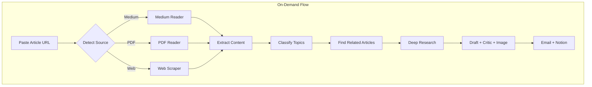

#### Implementation

```python
# pipelines/on_demand.py
from pipelines.document_reader import DocumentReader
from pipelines.medium_reader import MediumReader
from pipelines.ingestion import WebScraper
from intelligence.classifier import TopicClassifier
from storage.chroma_store import ChromaStore
import re

class OnDemandPipeline:
    def __init__(self, orchestrator, vector_store):
        self.doc_reader = DocumentReader()
        self.medium_reader = MediumReader()
        self.web_scraper = WebScraper()
        self.classifier = TopicClassifier()
        self.vector_store = vector_store
        self.orchestrator = orchestrator
    
    def process_url(self, url: str) -> dict:
        """Process any URL and generate a LinkedIn post."""
        
        # Step 1: Detect source and read content
        article = self._read_article(url)
        print(f"Read article: {article['title']}")
        
        # Step 2: Classify topic
        article["topic"] = self.classifier.classify(article["content"])
        print(f"Topic: {article['topic']}")
        
        # Step 3: Find related articles from VectorDB
        related = self.vector_store.similarity_search(
            article["content"][:500],  # Use first 500 chars as query
            k=5
        )
        print(f"Found {len(related)} related articles")
        
        # Step 4-7: Run through orchestrator (Research → Draft → Critic → Image)
        result = self.orchestrator.run(
            articles=[article],
            related_articles=related,
            mode="on_demand"
        )
        
        return result
    
    def _read_article(self, url: str) -> dict:
        """Route to appropriate reader based on URL."""
        
        # Medium detection
        if "medium.com" in url or self._is_medium_domain(url):
            return self.medium_reader.read_article(url)
        
        # PDF detection
        if url.endswith(".pdf"):
            return self._read_pdf_url(url)
        
        # Generic web scraping
        return self.web_scraper.scrape(url)
    
    def _is_medium_domain(self, url: str) -> bool:
        """Check if URL is a Medium custom domain."""
        # Could check for Medium meta tags
        return False
    
    def _read_pdf_url(self, url: str) -> dict:
        """Download and read PDF from URL."""
        import tempfile
        import requests
        
        response = requests.get(url)
        with tempfile.NamedTemporaryFile(suffix=".pdf", delete=False) as f:
            f.write(response.content)
            text = self.doc_reader.read_pdf_local(f.name)
        
        return {
            "title": url.split("/")[-1].replace(".pdf", ""),
            "content": text,
            "source": "PDF URL",
            "url": url
        }
```

#### CLI Usage

```python
# main.py - Add on-demand mode
import argparse

def main():
    parser = argparse.ArgumentParser()
    parser.add_argument("--url", help="Process single article URL")
    parser.add_argument("--daily", action="store_true", help="Run daily pipeline")
    args = parser.parse_args()
    
    pipeline = DailyContentPipeline()
    
    if args.url:
        # On-Demand Mode
        on_demand = OnDemandPipeline(pipeline.orchestrator, pipeline.vector_store)
        result = on_demand.process_url(args.url)
        print(f"Post generated! Notion: {result.get('notion_url')}")
    elif args.daily or not args.url:
        # Daily Mode (scheduled or immediate)
        pipeline.run_daily_pipeline()
```

#### Example Commands

```bash
# On-demand: Generate post from specific article
python main.py --url "https://techcrunch.com/gpt-5-announcement"

# On-demand: Medium article (requires ENABLE_MEDIUM_BYPASS=true)
python main.py --url "https://medium.com/@author/paywalled-article"

# Daily mode: Run scheduled pipeline
python main.py --daily
```

**Chunking Strategies**:

| Strategy | Chunk Size | Overlap | Use Case |
|----------|------------|---------|----------|
| **Fixed Size** | 500 tokens | 50 tokens | Simple, fast |
| **Semantic** | Variable | Context-aware | Better coherence |
| **Sentence** | 3-5 sentences | 1 sentence | Preserves meaning |
| **Recursive** | 500 tokens | 100 tokens | Respects structure |

```python
# pipelines/chunking.py
from langchain.text_splitter import RecursiveCharacterTextSplitter

class ArticleChunker:
    def __init__(self):
        self.splitter = RecursiveCharacterTextSplitter(
            chunk_size=500,
            chunk_overlap=100,
            separators=["\n\n", "\n", ". ", " ", ""]
        )
    
    def chunk_article(self, article: dict) -> list:
        """Split article into indexed chunks."""
        chunks = self.splitter.split_text(article["content"])
        return [
            {
                "text": chunk,
                "metadata": {
                    "source": article["source"],
                    "title": article["title"],
                    "date": article["date"],
                    "chunk_index": i,
                    "total_chunks": len(chunks)
                }
            }
            for i, chunk in enumerate(chunks)
        ]
```

**Flow**:
```
RSS → Fetch → Clean → Chunk → Embed → Index → Store in ChromaDB
```

---

### 2. RAG Pipeline with Semantic Search

**Purpose**: When writing a post, retrieve the most relevant recent articles to provide context.

| Component | Technology | Purpose |
|-----------|------------|---------|
| Query Encoder | `sentence-transformers` | Encode user query |
| Semantic Search | `chromadb` similarity | Find top-k relevant docs |
| Context Builder | Custom | Assemble RAG context |
| LLM Generation | Gemini/Perplexity | Generate with context |

**Embedding Model**: `all-MiniLM-L6-v2` (fast, good quality, 384 dims)

---

### 3. Intelligence Features

#### Topic Classification
- **Model**: Fine-tuned BERT or zero-shot with `facebook/bart-large-mnli`
- **Categories**: Research, Product Launch, Funding, Policy, Tutorial, Opinion
- **Purpose**: Tag articles for filtering and recommendation

#### Anomaly Detection
- **Method**: Statistical deviation in topic frequency + semantic outliers
- **Purpose**: Identify "breaking" or unusually trending topics
- **Implementation**: Track rolling 7-day topic distribution, flag spikes

#### Recommendation Engine
- **Input**: User preferences (topics, sources, past engagement)
- **Output**: Ranked list of articles to feature
- **Algorithm**: Hybrid (content-based + popularity weighting)

---

### 4. Multi-Agent Architecture (LangChain)

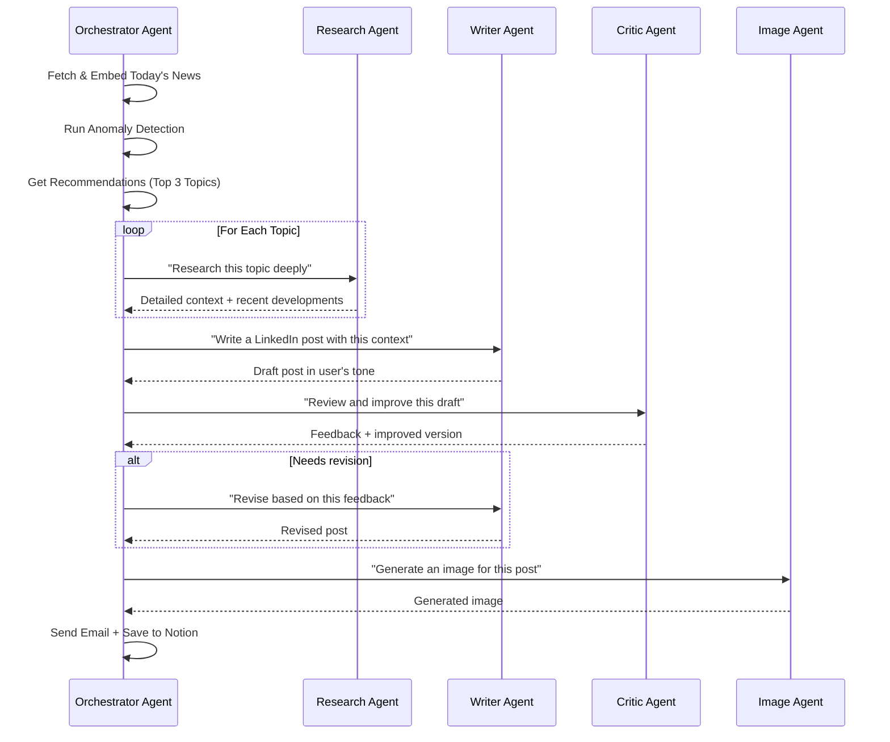

#### Agent Definitions

| Agent | LLM | Tools | Role |
|-------|-----|-------|------|
| **Orchestrator** | Gemini 2.0 Flash | MCP Tools, DB Access | Coordinates workflow |
| **Research Agent** | Perplexity (sonar-pro) | Web Search | Deep dive on topics |
| **Writer Agent** | Gemini 2.0 Flash | RAG Context | Draft posts in user tone |
| **Critic Agent** | Groq Llama 3.3 70B | - | Review, rate, improve drafts |
| **Image Agent** | Gemini (Imagen) | - | Generate visuals |

#### Critic Agent (Council) Implementation

**Why Groq?**
- ✅ **Free tier** (no credit card required)
- ✅ **Llama 3.3 70B** (high quality for critique)
- ✅ **Ultra-fast inference** (~10x faster than others)
- ✅ **Rate limits**: 30 req/min, 6000 tokens/min (plenty for reviews)

```python
# agents/critic_agent.py
from groq import Groq
import os

class CriticAgent:
    def __init__(self):
        self.client = Groq(api_key=os.getenv("GROQ_API_KEY"))
        self.model = "llama-3.3-70b-versatile"
    
    def review_post(self, draft: str, context: dict) -> dict:
        """Review a LinkedIn post and provide feedback."""
        
        prompt = f'''You are a LinkedIn content critic for a tech founder.

**Draft Post**:
{draft}

**Topic Context**:
{context.get("topic", "AI News")}

**Review Criteria**:
1. Hook strength (first line grabs attention?)
2. Value delivery (clear insight for readers?)
3. Tone (professional but conversational?)
4. Length (150-200 words ideal)
5. Call-to-action (ends with engagement prompt?)
6. Hashtag relevance

**Output Format** (JSON):
{{
    "score": 1-10,
    "strengths": ["..."],
    "improvements": ["..."],
    "revised_post": "Your improved version here"
}}
'''
        
        response = self.client.chat.completions.create(
            model=self.model,
            messages=[{"role": "user", "content": prompt}],
            temperature=0.3,
            max_tokens=1500
        )
        
        return self._parse_response(response.choices[0].message.content)
    
    def _parse_response(self, content: str) -> dict:
        import json
        try:
            return json.loads(content)
        except:
            return {"score": 7, "revised_post": content}
```

#### Review Loop in Orchestrator

```python
# In orchestrator.py
def generate_post_with_review(self, context):
    # Step 1: Generate draft
    draft = self.writer.generate(context)
    
    # Step 2: Critic review
    review = self.critic.review_post(draft, context)
    
    # Step 3: Accept or revise
    if review["score"] >= 8:
        return review.get("revised_post", draft)
    else:
        # Use critic's improved version
        return review["revised_post"]
```

---

### 5. MCP (Model Context Protocol) Integration

MCP allows agents to use external tools in a standardized way.

**Tools to Expose**:
- `search_web`: Query Perplexity or Google
- `fetch_rss`: Get latest from a specific feed
- `query_vectordb`: Semantic search over stored articles
- `send_email`: Deliver the final content
- `schedule_task`: Set future execution times

---

### 6. LLM Configuration & Response Handling

#### Review Loop in Orchestrator

```python
# In orchestrator.py
def generate_post_with_review(self, context):
    # Step 1: Generate draft
    draft = self.writer.generate(context)
    
    # Step 2: Critic review
    review = self.critic.review_post(draft, context)
    
    # Step 3: Accept or revise
    if review["score"] >= 8:
        return review.get("revised_post", draft)
    else:
        # Use critic's improved version
        return review["revised_post"]
```

#### Response Modes

| Mode | Use Case | Implementation |
|------|----------|----------------|
| **Streamed** | Real-time UI, long outputs | `stream=True`, yield chunks |
| **Unstreamed** | Batch processing, API calls | `stream=False`, await full response |

#### Generation Parameters

```python
# config.py - LLM Parameter Presets
LLM_CONFIGS = {
    "creative_writing": {
        "temperature": 0.9,      # Higher for creativity
        "top_p": 0.95,           # Nucleus sampling
        "top_k": 50,             # Limit token pool
        "frequency_penalty": 0.3, # Reduce repetition
        "max_tokens": 1500,      # LinkedIn post length
    },
    "research": {
        "temperature": 0.3,      # Lower for accuracy
        "top_p": 0.8,
        "top_k": 40,
        "frequency_penalty": 0.1,
        "max_tokens": 2000,
    },
    "structured_output": {
        "temperature": 0.1,      # Very precise
        "top_p": 0.5,
        "top_k": 20,
        "frequency_penalty": 0.0,
        "max_tokens": 500,
    }
}
```

| Parameter | Range | Effect |
|-----------|-------|--------|
| `temperature` | 0.0 - 2.0 | Randomness in output (higher = more creative) |
| `top_p` | 0.0 - 1.0 | Nucleus sampling threshold |
| `top_k` | 1 - 100 | Limit vocabulary to top K tokens |
| `frequency_penalty` | -2.0 - 2.0 | Penalize repeated tokens |
| `max_tokens` | 1 - 8192 | Maximum output length |

---

### 7. Agent Reasoning Patterns

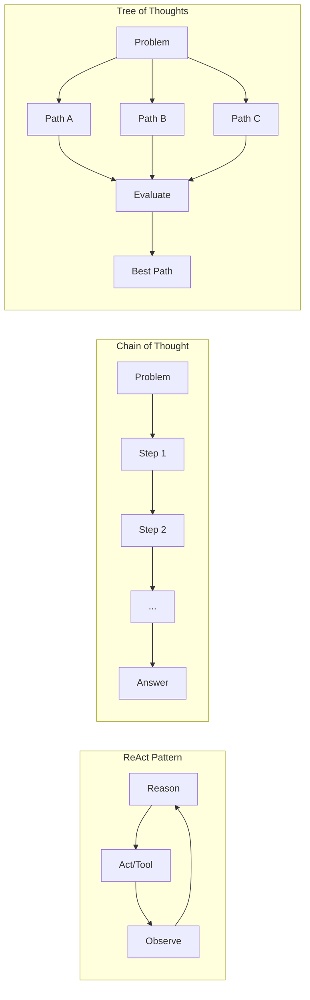

#### ReAct (Reason + Act) - Primary Pattern

Used by all agents for tool-based reasoning:

```
Thought: I need to find the latest AI news about GPT-5 rumors.
Action: search_web("GPT-5 release date rumors January 2026")
Observation: Found 3 articles mentioning potential Q2 2026 release...
Thought: I should verify this with a second source.
Action: query_vectordb("GPT-5 OpenAI announcements")
Observation: Previous articles mentioned Sam Altman's hints about...
Thought: I have enough context to write about this.
Final Answer: [Synthesized response]
```

#### Chain of Thought (CoT) - For Complex Reasoning

Used by Writer Agent for structured post creation:

```
Let me think step by step:
1. First, identify the main insight from today's top article
2. Then, consider why this matters to my LinkedIn audience
3. Next, craft a hook that grabs attention
4. Finally, add a call-to-action
```

#### Tree of Thoughts (ToT) - For Creative Exploration

Used by Writer Agent when multiple angles are possible:

```python
# Explore multiple post angles
thoughts = [
    {"angle": "technical_deep_dive", "score": 0.7},
    {"angle": "business_impact", "score": 0.9},   # Winner
    {"angle": "personal_story", "score": 0.6},
]
# Select highest scoring path
```

#### Observation & Reflection Loop

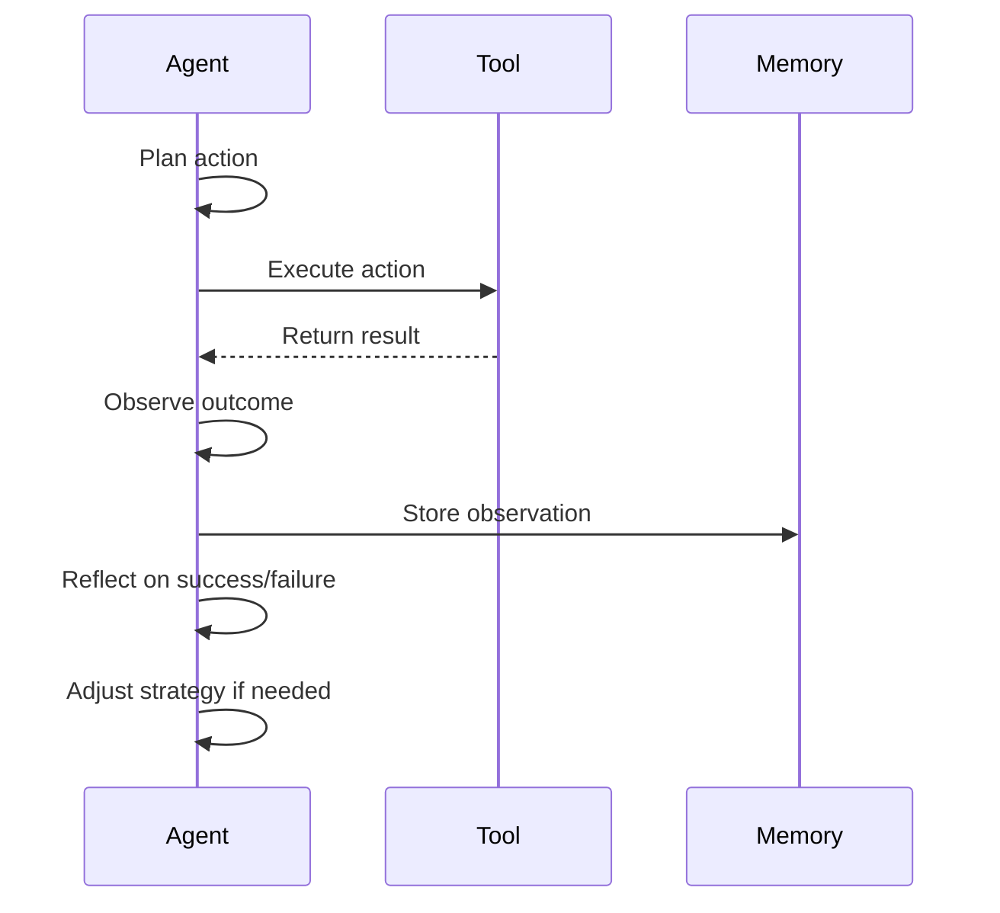

---

### 8. Observability with LangSmith

**Purpose**: Trace, debug, and monitor all LLM calls and agent actions.

```python
# config.py
import os
os.environ["LANGCHAIN_TRACING_V2"] = "true"
os.environ["LANGCHAIN_API_KEY"] = "your-langsmith-api-key"
os.environ["LANGCHAIN_PROJECT"] = "weekly-article-flow"
```

#### What Gets Traced

| Component | Traced Data |
|-----------|-------------|
| LLM Calls | Input, output, tokens, latency, cost |
| Agent Steps | Reasoning, tool calls, observations |
| RAG Pipeline | Query, retrieved docs, relevance scores |
| Embeddings | Input text, vector dimensions |

#### Dashboard Features

- **Run History**: See every execution with full traces
- **Latency Tracking**: Identify slow steps
- **Cost Analysis**: Monitor API spend per agent
- **Error Debugging**: Inspect failed runs with full context
- **Feedback Loop**: Rate outputs for future fine-tuning

---

### 9. Memory Management: Forgetting & Aging Strategies

**Problem**: Vector databases grow indefinitely. Old news becomes irrelevant. We need smart memory management.

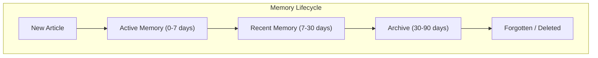

#### Aging Strategies

| Strategy | Formula | Use Case |
|----------|---------|----------|
| **Linear Decay** | `relevance = 1 - (age_days / max_age)` | Gradual, predictable decay |
| **Exponential Decay** | `relevance = e^(-λ * age_days)` | Fast initial decay, long tail |
| **Step Function** | `if age > threshold: relevance = 0` | Hard cutoff (news is binary) |
| **Importance-Weighted** | `relevance = base_score * decay_factor` | Keep high-impact articles longer |

#### Implementation

```python
# intelligence/memory_manager.py
from datetime import datetime, timedelta
import math

class MemoryManager:
    def __init__(self, vector_store):
        self.store = vector_store
        self.config = {
            "hot_window": 7,      # Days in active memory
            "warm_window": 30,    # Days in recent memory  
            "cold_window": 90,    # Days before deletion
            "decay_lambda": 0.1,  # Exponential decay rate
        }
    
    def calculate_relevance(self, article_date: datetime) -> float:
        """Exponential decay based on article age."""
        age_days = (datetime.now() - article_date).days
        return math.exp(-self.config["decay_lambda"] * age_days)
    
    def apply_forgetting(self):
        """Remove articles past the cold window."""
        cutoff = datetime.now() - timedelta(days=self.config["cold_window"])
        self.store.delete(where={"date": {"$lt": cutoff.isoformat()}})
    
    def weighted_search(self, query: str, k: int = 10):
        """Search with time-decayed relevance scoring."""
        results = self.store.similarity_search(query, k=k*2)
        for doc in results:
            age_score = self.calculate_relevance(doc.metadata["date"])
            doc.score = doc.similarity * 0.6 + age_score * 0.4
        return sorted(results, key=lambda x: x.score, reverse=True)[:k]
```

#### Forgetting Policies

| Policy | Trigger | Action |
|--------|---------|--------|
| **Time-Based** | Article > 90 days old | Delete from vector DB |
| **Capacity-Based** | DB size > 10,000 docs | Remove lowest-scored 20% |
| **Relevance-Based** | Score < 0.1 threshold | Archive to cold storage |
| **Duplicate Detection** | >0.95 similarity | Keep only most recent |

---

### 10. Summarization & Compression

**Problem**: Long articles waste tokens. Context windows are limited. We need efficient compression.

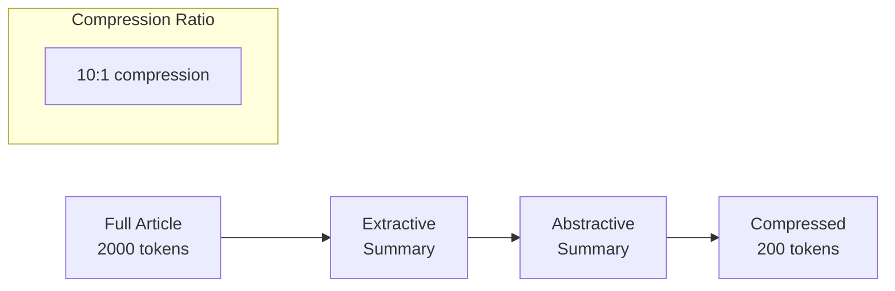

#### Summarization Levels

| Level | Tokens | Use Case | Method |
|-------|--------|----------|--------|
| **Full** | 2000+ | Deep research, archival | None |
| **Detailed** | 500-800 | RAG context | Extractive |
| **Concise** | 150-300 | Multiple article comparison | Abstractive |
| **Headline** | 20-50 | Quick scan, recommendations | Key phrase extraction |

#### Implementation

```python
# intelligence/summarizer.py
from transformers import pipeline
from langchain_google_genai import ChatGoogleGenerativeAI

class ArticleSummarizer:
    def __init__(self):
        # Fast extractive summarization (local)
        self.extractive = pipeline(
            "summarization", 
            model="facebook/bart-large-cnn",
            max_length=300
        )
        # High-quality abstractive (API)
        self.abstractive = ChatGoogleGenerativeAI(
            model="gemini-2.0-flash",
            temperature=0.3
        )
    
    def extract_summary(self, text: str, max_tokens: int = 300) -> str:
        """Fast local extractive summarization."""
        return self.extractive(text, max_length=max_tokens)[0]["summary_text"]
    
    def abstract_summary(self, text: str, style: str = "concise") -> str:
        """LLM-powered abstractive summarization."""
        prompts = {
            "concise": "Summarize in 2-3 sentences, focusing on key facts:",
            "bullet": "Extract 3-5 key bullet points:",
            "headline": "Write a single compelling headline:",
        }
        return self.abstractive.invoke(f"{prompts[style]}\n\n{text}").content
    
    def compress_for_rag(self, articles: list) -> str:
        """Compress multiple articles into RAG context."""
        summaries = []
        for article in articles:
            summary = self.extract_summary(article["content"], max_tokens=150)
            summaries.append(f"[{article['source']}] {summary}")
        return "\n\n".join(summaries)
```

#### Compression Strategies

| Strategy | When to Use | Savings |
|----------|-------------|---------|
| **Extractive** | Preserving exact quotes/facts | 60-70% |
| **Abstractive** | Capturing essence, paraphrasing | 80-90% |
| **Hierarchical** | Very long docs (chunk → summarize → merge) | 90%+ |
| **Semantic Chunking** | Split on meaning, not tokens | Variable |

#### Context Window Optimization

```python
# When building RAG context:
def build_optimized_context(articles: list, max_tokens: int = 4000):
    """Fit maximum info in limited context window."""
    
    # Sort by relevance
    articles = sorted(articles, key=lambda x: x["score"], reverse=True)
    
    context_parts = []
    token_count = 0
    
    for article in articles:
        # Progressively compress as we fill the window
        if token_count < max_tokens * 0.5:
            summary = summarizer.extract_summary(article, max_tokens=300)
        elif token_count < max_tokens * 0.8:
            summary = summarizer.abstract_summary(article, style="concise")
        else:
            summary = summarizer.abstract_summary(article, style="headline")
        
        context_parts.append(summary)
        token_count += len(summary.split()) * 1.3  # Rough token estimate
        
        if token_count >= max_tokens:
            break
    
    return "\n\n".join(context_parts)
```

---

### 11. Notion Integration (Post Storage)

**Purpose**: Automatically save generated LinkedIn posts to your Notion database for archival and review.

**Your Notion Database**: `LinkedIn-Posts-2ecb15cc6736806e9dd7f174b4a1dbe0`

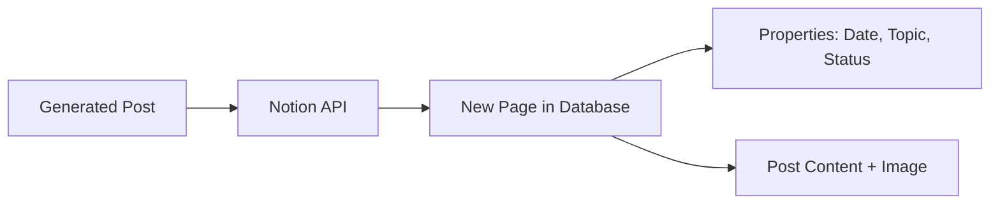

#### Setup Steps

1. **Create Notion Integration**: Go to [notion.so/my-integrations](https://notion.so/my-integrations)
2. **Get API Token**: Copy the "Internal Integration Secret"
3. **Share Database**: Open your LinkedIn Posts database → Share → Add your integration

#### Implementation

```python
# utils/notion_client.py
from notion_client import Client
from datetime import datetime
import os

class NotionPostSaver:
    def __init__(self):
        self.client = Client(auth=os.getenv("NOTION_API_TOKEN"))
        self.database_id = os.getenv("NOTION_DATABASE_ID")
    
    def save_post(
        self,
        post_content: str,
        topic: str,
        sources: list[str],
        image_url: str = None
    ) -> str:
        """Create a new page in the LinkedIn Posts database."""
        
        # Build page properties
        properties = {
            "Title": {
                "title": [{"text": {"content": f"AI Digest - {datetime.now().strftime('%B %d, %Y')}"}}]
            },
            "Date": {
                "date": {"start": datetime.now().isoformat()}
            },
            "Topic": {
                "select": {"name": topic}
            },
            "Status": {
                "select": {"name": "Draft"}
            },
            "Sources": {
                "multi_select": [{"name": src[:100]} for src in sources[:5]]
            }
        }
        
        # Build page content (blocks)
        children = [
            {
                "object": "block",
                "type": "heading_2",
                "heading_2": {"rich_text": [{"text": {"content": "LinkedIn Post"}}]}
            },
            {
                "object": "block",
                "type": "paragraph",
                "paragraph": {"rich_text": [{"text": {"content": post_content}}]}
            }
        ]
        
        # Add image if available
        if image_url:
            children.append({
                "object": "block",
                "type": "image",
                "image": {"type": "external", "external": {"url": image_url}}
            })
        
        # Create the page
        response = self.client.pages.create(
            parent={"database_id": self.database_id},
            properties=properties,
            children=children
        )
        
        return response["url"]
```

#### Database Schema (Recommended)

| Property | Type | Purpose |
|----------|------|---------|
| **Title** | Title | Post headline/date |
| **Date** | Date | When generated |
| **Topic** | Select | Main AI topic covered |
| **Status** | Select | Draft / Published / Archived |
| **Sources** | Multi-select | News sources used |
| **Engagement** | Number | Track LinkedIn metrics (manual) |

---

### 12. Prompt Engineering Best Practices

**Purpose**: Craft high-quality prompts that produce consistent, accurate outputs.

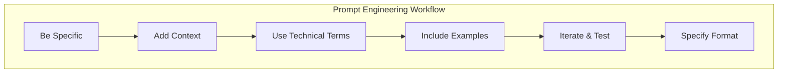

#### Core Principles

| Principle | Description | Example |
|-----------|-------------|--------|
| **Be Specific** | Clearly state what you want | "Write a LinkedIn post" → "Write a 150-word LinkedIn post about GPT-5 for tech founders" |
| **Add Context** | Provide background info | Include article summaries, target audience, tone |
| **Technical Terms** | Use domain vocabulary | "AI", "LLM", "inference", "fine-tuning" |
| **Use Examples** | Show desired output format | Few-shot prompting with sample posts |
| **Iterate & Test** | Refine based on results | A/B test different prompt versions |
| **Specify Format** | Define structure, length | "Use bullet points, max 200 words, include emoji" |

#### Prompt Templates

```python
# agents/prompts.py

PROMPT_TEMPLATES = {
    "linkedin_post": '''
You are a LinkedIn content creator for a tech founder.

**Context**:
{rag_context}

**Task**: Write a LinkedIn post about the most interesting AI development from today's news.

**Requirements**:
- Hook in the first line (question or bold statement)
- 150-200 words maximum
- Professional but conversational tone
- Include 1-2 relevant hashtags
- End with a call-to-action or question

**Tone Reference**:
{user_tone_examples}

**Output Format**:
[Hook]

[Main insight - 2-3 paragraphs]

[Call-to-action]

#Hashtags
''',

    "research_query": '''
You are a research assistant finding the latest information.

**Topic**: {topic}
**Time Range**: Last 24 hours
**Focus Areas**: {focus_areas}

**Task**: Provide a comprehensive summary including:
1. Key developments
2. Major players involved
3. Potential implications
4. Credible sources

Be factual and cite specific details.
''',

    "summarize_article": '''
Summarize this article for a busy tech executive.

**Article**:
{article_content}

**Output**:
- 2-3 sentence summary
- Key takeaway
- Relevance to AI industry (1-10 score)
'''
}
```

#### Dynamic Prompt Construction

```python
# agents/prompt_builder.py

class PromptBuilder:
    def __init__(self):
        self.templates = PROMPT_TEMPLATES
    
    def build_linkedin_prompt(
        self,
        rag_context: str,
        tone_examples: list,
        constraints: dict = None
    ) -> str:
        """Build a context-aware LinkedIn post prompt."""
        
        # Format tone examples
        tone_str = "\n---\n".join(tone_examples[:3])
        
        # Apply constraints
        constraints = constraints or {}
        length = constraints.get("max_words", 200)
        style = constraints.get("style", "professional")
        
        prompt = self.templates["linkedin_post"].format(
            rag_context=rag_context,
            user_tone_examples=tone_str
        )
        
        # Add dynamic constraints
        prompt += f"\n**Additional Constraints**: Max {length} words, {style} style."
        
        return prompt
    
    def few_shot_examples(self, examples: list) -> str:
        """Format examples for few-shot prompting."""
        formatted = []
        for i, ex in enumerate(examples, 1):
            formatted.append(f"Example {i}:\nInput: {ex['input']}\nOutput: {ex['output']}")
        return "\n\n".join(formatted)
```

#### Prompt Testing Framework

```python
# tests/test_prompts.py

class PromptTester:
    def __init__(self, llm):
        self.llm = llm
        self.results = []
    
    def test_prompt_variants(self, variants: list, test_input: str):
        """A/B test different prompt versions."""
        for variant in variants:
            response = self.llm.invoke(variant.format(input=test_input))
            self.results.append({
                "variant": variant[:50],
                "output": response.content,
                "tokens": response.usage.total_tokens,
                "latency": response.response_time
            })
        return self.results
    
    def evaluate_output(self, output: str, criteria: dict) -> dict:
        """Score output against criteria."""
        scores = {}
        scores["length_ok"] = len(output.split()) <= criteria.get("max_words", 200)
        scores["has_hook"] = output.split("\n")[0].endswith("?") or len(output.split("\n")[0]) < 100
        scores["has_hashtags"] = "#" in output
        return scores
```

---

## Proposed File Structure

```
Weekly Article Flow/
├── .env                          # API keys
├── requirements.txt              # Dependencies
├── config.py                     # Configuration + LLM presets
├── main.py                       # Entry point + daily loop

├── agents/
│   ├── __init__.py
│   ├── orchestrator.py           # Main coordinator (ReAct)
│   ├── research_agent.py         # Perplexity-powered research
│   ├── writer_agent.py           # Gemini-powered writing (CoT/ToT)
│   ├── critic_agent.py           # Groq Llama review & improve
│   ├── prompts.py                # Prompt templates
│   └── prompt_builder.py         # Dynamic prompt construction

├── pipelines/
│   ├── __init__.py
│   ├── ingestion.py              # RSS fetching + web scraping
│   ├── document_reader.py        # PDF extraction (PyPDF2)
│   ├── medium_reader.py          # Medium paywall bypass (optional)
│   ├── on_demand.py              # On-demand URL processing
│   ├── chunking.py               # Text chunking strategies
│   ├── rag.py                    # RAG pipeline + context building
│   └── recommendation.py         # Article ranking

├── intelligence/
│   ├── __init__.py
│   ├── classifier.py             # Topic classification (zero-shot)
│   ├── trends.py                 # Simple trend detection
│   ├── embeddings.py             # Sentence transformers
│   ├── summarizer.py             # Extractive/Abstractive
│   └── memory_manager.py         # Forgetting & aging

├── storage/
│   ├── __init__.py
│   ├── chroma_store.py           # ChromaDB wrapper (Local persistence)
│   └── chroma_data/              # Persisted local vectors

├── mcp/
│   ├── __init__.py
│   └── tools.py                  # MCP tool definitions

├── utils/
│   ├── __init__.py
│   ├── emailer.py                # Email delivery
│   ├── notion_client.py          # Notion API integration
│   └── retry.py                  # Retry/backoff logic

└── tests/
    ├── __init__.py
    ├── conftest.py               # Pytest fixtures
    ├── test_ingestion.py
    ├── test_agents.py
    ├── test_prompts.py
    └── test_rag.py
```

---

## 12. Main Execution Loop

**Purpose**: The complete daily workflow as a single orchestrated loop.

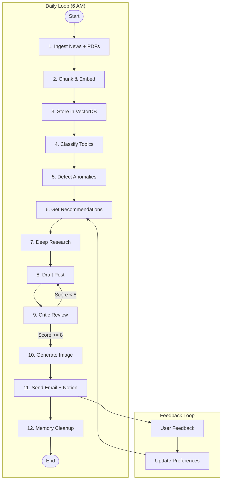

### 12. Main Execution Loop

**Purpose**: The complete daily workflow as a single orchestrated loop.

#### CLI Implementation

```python
# main.py
import argparse
import schedule
import time
from datetime import datetime
from dotenv import load_dotenv

from pipelines.ingestion import NewsFetcher
from pipelines.chunking import ArticleChunker
from pipelines.rag import RAGPipeline
from pipelines.recommendation import RecommendationEngine
from intelligence.classifier import TopicClassifier
from intelligence.trends import TrendDetector
from intelligence.embeddings import EmbeddingService
from intelligence.memory_manager import MemoryManager
from intelligence.summarizer import ArticleSummarizer
from storage.chroma_store import ChromaStore
from agents.orchestrator import OrchestratorAgent
from agents.critic_agent import CriticAgent
from pipelines.on_demand import OnDemandPipeline
from utils.notion_client import NotionPostSaver
from utils.retry import with_retry

load_dotenv()

class DailyContentPipeline:
    def __init__(self):
        # Initialize all components
        self.chroma_store = ChromaStore()           
        self.embedder = EmbeddingService()
        self.chunker = ArticleChunker()
        self.classifier = TopicClassifier()
        self.trend_detector = TrendDetector()
        self.recommender = RecommendationEngine()
        self.memory_manager = MemoryManager(self.chroma_store)
        self.summarizer = ArticleSummarizer()
        self.rag = RAGPipeline(self.chroma_store, self.summarizer)
        self.critic = CriticAgent()
        self.orchestrator = OrchestratorAgent(critic=self.critic)
        self.notion = NotionPostSaver()
        self.fetcher = NewsFetcher()
    
    @with_retry(max_attempts=3, backoff=2.0)
    def run_daily_pipeline(self):
        """Execute the complete daily content generation pipeline."""
        print(f"[{datetime.now()}] Starting daily pipeline...")
        
        # Phase 1: Ingestion
        articles = self.fetcher.fetch_feeds()
        
        # Phase 2: Store & Classify
        # ... (Implementation similar to previous steps) ...
        
        # Phase 3: Generate
        # ... (Orchestrator run) ...

def main():
    parser = argparse.ArgumentParser()
    parser.add_argument("--url", help="Process single article URL")
    parser.add_argument("--daily", action="store_true", help="Run daily pipeline")
    args = parser.parse_args()
    
    pipeline = DailyContentPipeline()
    
    if args.url:
        # On-Demand Mode
        on_demand = OnDemandPipeline(pipeline.orchestrator, pipeline.chroma_store)
        result = on_demand.process_url(args.url)
        print(f"Post generated! Notion: {result.get('notion_url')}")
    elif args.daily or not args.url:
        # Daily Mode
        pipeline.run_daily_pipeline()

if __name__ == "__main__":
    main()
```
from storage.chroma_store import ChromaStore
from storage.mongo_store import MongoStore
from agents.orchestrator import OrchestratorAgent
from agents.critic_agent import CriticAgent
from utils.emailer import send_email
from utils.notion_client import NotionPostSaver
from utils.retry import with_retry
from config import CONFIG

load_dotenv()

class DailyContentPipeline:
    def __init__(self):
        # Initialize all components
        self.chroma_store = ChromaStore()           
        self.embedder = EmbeddingService()
        self.chunker = ArticleChunker()
        self.classifier = TopicClassifier()
        self.trend_detector = TrendDetector()
        self.recommender = RecommendationEngine()
        self.memory_manager = MemoryManager(self.chroma_store)
        self.summarizer = ArticleSummarizer()
        self.rag = RAGPipeline(self.chroma_store, self.summarizer)
        self.critic = CriticAgent()
        self.orchestrator = OrchestratorAgent(critic=self.critic)
        self.notion = NotionPostSaver()
        self.fetcher = NewsFetcher()
    
    @with_retry(max_attempts=3, backoff=2.0)
    def run_daily_pipeline(self):
        """Execute the complete daily content generation pipeline."""
        print(f"[{datetime.now()}] Starting daily pipeline...")
        
        # Phase 1: Data Ingestion
        print("Phase 1: Ingesting news...")
        articles = self.fetcher.fetch_all_feeds()
        print(f"  Fetched {len(articles)} articles")
        
        # Phase 2: Chunk & Embed
        print("Phase 2: Chunking and embedding...")
        all_chunks = []
        for article in articles:
            chunks = self.chunker.chunk_article(article)
            all_chunks.extend(chunks)
        
        embeddings = self.embedder.embed_batch([c["text"] for c in all_chunks])
        
        # Phase 3: Store
        print("Phase 3: Storing in VectorDB...")
        self.vector_store.add_documents(all_chunks, embeddings)
        
        # Phase 4: Classify
        print("Phase 4: Classifying topics...")
        for article in articles:
            article["topic"] = self.classifier.classify(article["content"])
        
        # Phase 5: Anomaly Detection
        print("Phase 5: Detecting anomalies...")
        trending_topics = self.anomaly_detector.detect(articles)
        print(f"  Trending: {trending_topics}")
        
        # Phase 6: Recommendations
        print("Phase 6: Getting recommendations...")
        top_articles = self.recommender.rank(
            articles, 
            trending=trending_topics,
            user_prefs=CONFIG.get("user_preferences", {})
        )
        
        # Phase 7-9: Agent Orchestration
        print("Phase 7-9: Running agent orchestration...")
        result = self.orchestrator.run(
            articles=top_articles[:3],
            rag_pipeline=self.rag,
            summarizer=self.summarizer
        )
        
        # Phase 10: Quality Check
        print("Phase 10: Quality check...")
        if not self._quality_check(result):
            print("  Quality check failed, regenerating...")
            result = self.orchestrator.run(
                articles=top_articles[:3],
                rag_pipeline=self.rag,
                constraints={"retry": True}
            )
        
        # Phase 11: Send Email
        print("Phase 11: Sending email...")
        send_email(
            subject=f"Your AI News Digest - {datetime.now().strftime('%B %d')}",
            body=result["post"],
            image_path=result.get("image_path"),
            to_email=CONFIG["email_recipient"]
        )
        
        # Phase 12: Cleanup
        print("Phase 12: Memory cleanup...")
        self.memory_manager.apply_forgetting()
        
        print(f"[{datetime.now()}] Pipeline complete!")
        return result
    
    def _quality_check(self, result: dict) -> bool:
        """Validate output quality."""
        post = result.get("post", "")
        checks = [
            len(post.split()) >= 100,  # Minimum length
            len(post.split()) <= 250,  # Maximum length
            "#" in post,               # Has hashtags
            not post.startswith("I"),  # Doesn't start with "I"
        ]
        return all(checks)


def main():
    pipeline = DailyContentPipeline()
    
    # Schedule daily run at 6 AM
    schedule.every().day.at("06:00").do(pipeline.run_daily_pipeline)
    
    # Also run memory cleanup at 2 AM
    schedule.every().day.at("02:00").do(
        pipeline.memory_manager.apply_forgetting
    )
    
    print("Scheduler started. Waiting for scheduled runs...")
    print("Press Ctrl+C to exit.")
    
    # For testing, run immediately
    if CONFIG.get("run_immediately", False):
        pipeline.run_daily_pipeline()
    
    while True:
        schedule.run_pending()
        time.sleep(60)


if __name__ == "__main__":
    main()
```

---

## 13. Error Handling & Retry Logic

```python
# utils/retry.py
import time
import functools
from typing import Callable, TypeVar

T = TypeVar('T')

def with_retry(
    max_attempts: int = 3,
    backoff: float = 2.0,
    exceptions: tuple = (Exception,)
) -> Callable:
    """Decorator for retry with exponential backoff."""
    def decorator(func: Callable[..., T]) -> Callable[..., T]:
        @functools.wraps(func)
        def wrapper(*args, **kwargs) -> T:
            last_exception = None
            for attempt in range(max_attempts):
                try:
                    return func(*args, **kwargs)
                except exceptions as e:
                    last_exception = e
                    wait_time = backoff ** attempt
                    print(f"Attempt {attempt + 1} failed: {e}. Retrying in {wait_time}s...")
                    time.sleep(wait_time)
            raise last_exception
        return wrapper
    return decorator


class CircuitBreaker:
    """Circuit breaker for external API calls."""
    def __init__(self, failure_threshold: int = 5, reset_timeout: int = 60):
        self.failure_count = 0
        self.failure_threshold = failure_threshold
        self.reset_timeout = reset_timeout
        self.last_failure_time = None
        self.state = "CLOSED"  # CLOSED, OPEN, HALF_OPEN
    
    def call(self, func: Callable, *args, **kwargs):
        if self.state == "OPEN":
            if time.time() - self.last_failure_time > self.reset_timeout:
                self.state = "HALF_OPEN"
            else:
                raise Exception("Circuit breaker is OPEN")
        
        try:
            result = func(*args, **kwargs)
            self._on_success()
            return result
        except Exception as e:
            self._on_failure()
            raise e
    
    def _on_success(self):
        self.failure_count = 0
        self.state = "CLOSED"
    
    def _on_failure(self):
        self.failure_count += 1
        self.last_failure_time = time.time()
        if self.failure_count >= self.failure_threshold:
            self.state = "OPEN"
```

---

## 14. Testing with Pytest Fixtures

```python
# tests/conftest.py
import pytest
from unittest.mock import Mock, patch
from datetime import datetime, timedelta

# ============ Sample Data Fixtures ============

@pytest.fixture
def sample_article():
    """A single sample article for testing."""
    return {
        "title": "OpenAI Announces GPT-5 Preview",
        "content": "OpenAI has announced a preview of GPT-5, their next-generation language model. The new model shows significant improvements in reasoning and code generation. Sam Altman stated that GPT-5 represents a major leap forward in AI capabilities.",
        "source": "TechCrunch",
        "url": "https://techcrunch.com/2026/01/20/openai-gpt-5",
        "date": datetime.now().isoformat(),
        "topic": None
    }

@pytest.fixture
def sample_articles(sample_article):
    """Multiple sample articles for batch testing."""
    articles = [sample_article]
    articles.append({
        "title": "Google Releases Gemini 3.0",
        "content": "Google has released Gemini 3.0, featuring improved multimodal capabilities and faster inference times.",
        "source": "The Verge",
        "url": "https://theverge.com/2026/01/20/gemini-3",
        "date": (datetime.now() - timedelta(hours=2)).isoformat(),
        "topic": None
    })
    return articles

@pytest.fixture
def sample_chunks(sample_article):
    """Pre-chunked article data."""
    return [
        {"text": "OpenAI has announced a preview of GPT-5.", "metadata": {"source": "TechCrunch", "chunk_index": 0}},
        {"text": "The new model shows significant improvements.", "metadata": {"source": "TechCrunch", "chunk_index": 1}},
    ]

# ============ Mock Service Fixtures ============

@pytest.fixture
def mock_vector_store():
    """Mock ChromaDB vector store."""
    store = Mock()
    store.add_documents = Mock(return_value=None)
    store.similarity_search = Mock(return_value=[
        Mock(page_content="Sample content", metadata={"source": "Test"}, score=0.95)
    ])
    store.delete = Mock(return_value=None)
    return store

@pytest.fixture
def mock_embedding_service():
    """Mock sentence transformer embeddings."""
    service = Mock()
    service.embed = Mock(return_value=[0.1] * 384)
    service.embed_batch = Mock(return_value=[[0.1] * 384, [0.2] * 384])
    return service

@pytest.fixture
def mock_llm():
    """Mock LLM for testing agents."""
    llm = Mock()
    llm.invoke = Mock(return_value=Mock(
        content="This is a test LinkedIn post about AI. #AI #Tech",
        usage=Mock(total_tokens=100),
        response_time=0.5
    ))
    return llm

@pytest.fixture
def mock_perplexity():
    """Mock Perplexity API for research agent."""
    with patch('agents.research_agent.PerplexityClient') as mock:
        mock.return_value.search = Mock(return_value={
            "answer": "GPT-5 is expected to be released in Q2 2026.",
            "sources": ["techcrunch.com", "theverge.com"]
        })
        yield mock

@pytest.fixture
def mock_groq():
    """Mock Groq API for critic agent."""
    with patch('agents.critic_agent.Groq') as mock:
        mock.return_value.chat.completions.create = Mock(return_value=Mock(
            choices=[Mock(message=Mock(content='''{
                "score": 8,
                "strengths": ["Strong hook", "Clear value"],
                "improvements": ["Add more data points"],
                "revised_post": "Improved test LinkedIn post about AI. #AI #Tech"
            }'''))]
        ))
        yield mock

# ============ Component Fixtures ============

@pytest.fixture
def chunker():
    """Real ArticleChunker instance."""
    from pipelines.chunking import ArticleChunker
    return ArticleChunker()

@pytest.fixture
def classifier():
    """Real TopicClassifier (may need model download)."""
    from intelligence.classifier import TopicClassifier
    return TopicClassifier()

@pytest.fixture
def memory_manager(mock_vector_store):
    """MemoryManager with mocked stores."""
    from intelligence.memory_manager import MemoryManager
    mock_mongo = Mock()
    mock_mongo.add_documents = Mock(return_value=None)
    return MemoryManager(mock_vector_store, mock_mongo)

@pytest.fixture
def mock_notion():
    """Mock Notion API for post saving."""
    with patch('utils.notion_client.Client') as mock:
        mock.return_value.pages.create = Mock(return_value={
            "url": "https://notion.so/test-page-123",
            "id": "test-page-123"
        })
        yield mock

@pytest.fixture
def mock_mongo_store():
    """Mock MongoDB Atlas store."""
    store = Mock()
    store.add_documents = Mock(return_value=None)
    store.similarity_search = Mock(return_value=[])
    store.delete = Mock(return_value=None)
    store.migrate_from_chroma = Mock(return_value=10)
    return store

@pytest.fixture
def mock_medium_reader():
    """Mock Medium reader for paywall bypass."""
    with patch('pipelines.medium_reader.requests.get') as mock:
        mock.return_value.text = '<h1>Test Article</h1><article>Content here</article>'
        yield mock

@pytest.fixture
def on_demand_pipeline(mock_vector_store, mock_llm, mock_groq, mock_notion):
    """Fully mocked on-demand pipeline for testing URL processing."""
    from pipelines.on_demand import OnDemandPipeline
    from agents.orchestrator import OrchestratorAgent
    
    orchestrator = Mock()
    orchestrator.run = Mock(return_value={
        "post": "Generated LinkedIn post",
        "image_url": "https://example.com/image.png",
        "notion_url": "https://notion.so/test"
    })
    
    pipeline = OnDemandPipeline(orchestrator, mock_vector_store)
    return pipeline

# ============ Integration Fixtures ============

@pytest.fixture
def pipeline(mock_vector_store, mock_embedding_service, mock_llm):
    """Fully mocked pipeline for integration testing."""
    from main import DailyContentPipeline
    
    pipeline = DailyContentPipeline()
    pipeline.vector_store = mock_vector_store
    pipeline.embedder = mock_embedding_service
    pipeline.orchestrator.llm = mock_llm
    
    return pipeline
```

### Example Tests

```python
# tests/test_ingestion.py
import pytest

class TestChunking:
    def test_chunk_article_returns_list(self, chunker, sample_article):
        chunks = chunker.chunk_article(sample_article)
        assert isinstance(chunks, list)
        assert len(chunks) > 0
    
    def test_chunks_have_metadata(self, chunker, sample_article):
        chunks = chunker.chunk_article(sample_article)
        for chunk in chunks:
            assert "metadata" in chunk
            assert "source" in chunk["metadata"]
            assert "chunk_index" in chunk["metadata"]

class TestMemoryManager:
    def test_calculate_relevance_today(self, memory_manager):
        from datetime import datetime
        score = memory_manager.calculate_relevance(datetime.now())
        assert 0.9 < score <= 1.0  # Very recent = high score
    
    def test_calculate_relevance_old(self, memory_manager):
        from datetime import datetime, timedelta
        old_date = datetime.now() - timedelta(days=30)
        score = memory_manager.calculate_relevance(old_date)
        assert score < 0.5  # Old = low score
```

---

## Technology Stack

### [Requirements]

#### [NEW] requirements.txt

```txt
# Core
python-dotenv
feedparser
schedule

# LLMs & Agents
google-genai
groq                        # Critic Agent (free Llama 3.3 70B)
langchain>=0.3.0
langchain-google-genai
langchain-community
langchain-core

# Observability
langsmith

# Embeddings & Vector DB (Hybrid)
sentence-transformers
chromadb                    # Hot layer (local, fast)
pymongo                     # Archival layer (MongoDB Atlas)
langchain-mongodb
torch

# HuggingFace Models
transformers
accelerate

# Classification (zero-shot)
# Uses transformers above

# Utilities
requests
beautifulsoup4
notion-client                # Notion API integration

# PDF Processing
PyPDF2                       # Text-based PDF extraction (free, covers 95% of cases)
# google-cloud-vision        # Optional: for scanned PDFs only
```

---

## RSS Sources (12 Feeds)

| Source | RSS URL |
|--------|---------|
| Artificial Intelligence News | `artificialintelligence-news.com/feed/` |
| Analytics Insight | `analyticsinsight.net/feed/` |
| TechCrunch AI | `techcrunch.com/category/artificial-intelligence/feed/` |
| MIT Tech Review AI | `technologyreview.com/topic/artificial-intelligence/feed` |
| VentureBeat AI | `venturebeat.com/category/ai/feed/` |
| ScienceDaily AI | `sciencedaily.com/rss/computers_math/artificial_intelligence.xml` |
| AWS ML Blog | `aws.amazon.com/blogs/machine-learning/feed/` |
| The Verge AI | `theverge.com/rss/ai-artificial-intelligence/index.xml` |
| Wired AI | `wired.com/feed/category/ai/latest/rss` |
| MIT News AI | `news.mit.edu/rss/topic/artificial-intelligence2` |
| Forbes AI | `forbes.com/ai/feed/` |
| Just AI News | `justainews.com/feed` |
| The Rundown AI | `rss.beehiiv.com/feeds/2R3C6Bt5wj.xml` |

---

## Verification Plan

### Phase 1: Infrastructure & Ingestion
- [ ] Test RSS fetching from all 12 sources
- [ ] Verify PDF text extraction (PyPDF2)
- [ ] Test Medium paywall bypass (Freedium)
- [ ] Verify Hybrid DB storage (Chroma hot + Mongo archival)

### Phase 2: Intelligence & Logic
- [ ] Test topic classifier accuracy
- [ ] Verify anomaly detection on sample data
- [ ] Test recommendation ranking
- [ ] Analyze memory manager aging logic (7-day cutoff)

### Phase 3: Agents & LLMs
- [ ] Test Research Agent (Perplexity) search depth
- [ ] Test Writer Agent (Gemini) draft quality
- [ ] **Test Critic Agent (Groq)** review loop & scoring
- [ ] Verify Image Agent generation (Gemini)

### Phase 4: Delivery & Integration
- [ ] Test specific On-Demand URL processing
- [ ] Verify Notion page creation & property formatting
- [ ] Test Email delivery with attachments
- [ ] Full end-to-end daily simulation

### Phase 5: Resilience
- [ ] Test retry logic on API failures
- [ ] Verify behavior when Freedium is down
- [ ] Check MongoDB free tier limits handling
